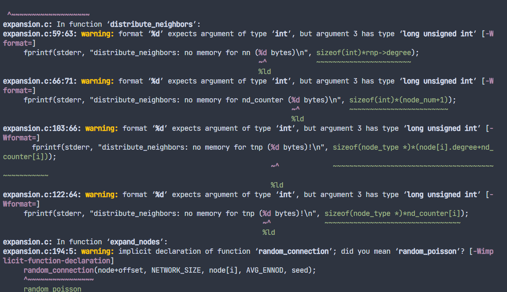

# NS3-Inet-3.0

Network Topology Generator for NS3, Inet3.0.

`Reprinted from University of Michigan(umich)`

---

## Install

```bash
# bash shell
cd NS3-Inet-3.0/inet-3.0

# build with Makefile
make
```



## Usage

```bash
inet [-n topology_size] [-d fraction of degree_one_nodes] [-p plane_dimension] [-s seed] [-f debug_output] [-V(sersion)]
```

| Syntax | Description                                                                                                                                                       |
| ------ | ----------------------------------------------------------------------------------------------------------------------------------------------------------------- |
| -n     | The number of nodes in the network must not be less than 3037                                                                                                     |
| -d     | The proportion of nodes with a degree of 1 in the network, the default is 0.3                                                                                     |
| -p     | The plane size of the network (interpreted as a coordinate axis), the default is 10000, and the plane size is 10000\*10000                                        |
| -s     | random number seed, default is 0                                                                                                                                  |
| -f     | The location of the debug output, the default is to output to the terminal window (standard error stderr), the content is the degree of node 0 (node[0].degree=…) |
| -v     | Check the Inet version, the latest is 3.0                                                                                                                         |

```bash
# bash shell
# View version number
./inet -v

Output:Inet 3.0
```

```bash
# bash shell
# Generate 5000 nodes and output to data.txt file
./inet -n 5000 > data.txt

Output:node[0].degree = 1025
```
